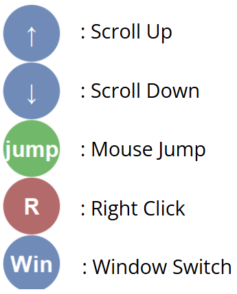

# AmirACLE - Accessible Computer Control Tool
A specialized floating control interface designed to enhance computer accessibility for users with limited mobility, developed during Hackahealth [Project Amir - 2024 — HackaHealth](https://www.hackahealth.ch/project-amir-2024) to assist Amir, a DJ and producer born with Duchenne Muscular Dystrophy, this tool aims to make daily computer interactions more efficient and comfortable.

Download and try the application [here](https://github.com/timungereth/amirACLE/blob/main/button_menu_app/dist/ButtonMenu.exe)


## About the Project

ButtonMenu was created to address the challenges faced by users who rely on mouth-controlled joysticks for computer interaction. While specialized hardware solutions exist for specific tasks (like music production), everyday computer use often remains cumbersome. This software-based solution provides quick access to essential controls through a floating interface that's always accessible.

## Features

- **Floating Control Window**: Always-accessible interface that stays on top of other windows
- **Target Window Selection**: Long-press anywhere to select a window for control
- **Smart Scrolling**: Control scrolling in any window without direct mouse movement
- **Quick Actions**:
  - Scroll Up/Down: Efficient scrolling without moving the cursor
  - Jump Action (Win+Shift+K): Quick keyboard shortcut execution
  - Right-Click Conversion: Convert next left-click to right-click
  - Window Switcher (Win+Tab): Easy window management
- **Accessibility Features**:
  - Transparent background for better visibility
  - Adjustable scaling based on display settings
  - High-contrast buttons for better visibility
- **System Integration**:
  - System tray icon for easy access
  - Simple exit with ESC key
  - Starts minimized to system tray
<p align="center" width="100%">
  
</p>
### Prerequisites
- Python 3.7+
- PyQt5
- Required packages listed in `requirements.txt`
- PowerToys, installed from Microsoft App Store, set there "Win+Shift+K" for mouse jump

## Installation
1. Clone the repository:
```bash
cd button_menu_app
```

2. Install dependencies:
```bash
pip install -e .
```

3. Customize the code `button_menu_app/button_menu.py`

4. Build executable:
```bash
# Run or double-click
button_menu_launch.bat
```
The executable will be available in `installer/ButtonMenu.exe`

double click on `installer/Setup_Autostart.bat`

## Usage

### Starting the Application
```bash
button-menu
```
Or double click on the  `ButtonMenu.exe` to launch it

### Basic Controls
1. **Select Target Window**: Long-press (0.5s) anywhere on the screen to select the window you want to control
2. **Scroll**: Use the ↑/↓ buttons to scroll in the selected window
3. **Right Click**: Press 'R' to convert your next left-click into a right-click
4. **Quick Actions**: Use 'jump' for Win+Shift+K or 'Win' for Win+Tab
5. **Exit**: Press ESC or use the system tray menu to quit


## Contributing

Contributions are welcome! Please feel free to submit a Pull Request. For major changes, please open an issue first to discuss what you would like to change.

## License

[MIT License](LICENSE)

## Acknowledgments

- Originally developed during a hackathon to assist Amir, a DJ and producer with Duchenne Muscular Dystrophy
- Special thanks to the hackathon organizers and mentors
- Built with PyQt5 for robust GUI implementation
- Inspired by the need for better accessibility tools in everyday computing

## Support

For support, please open an issue on the GitHub repository or contact the maintainers directly.